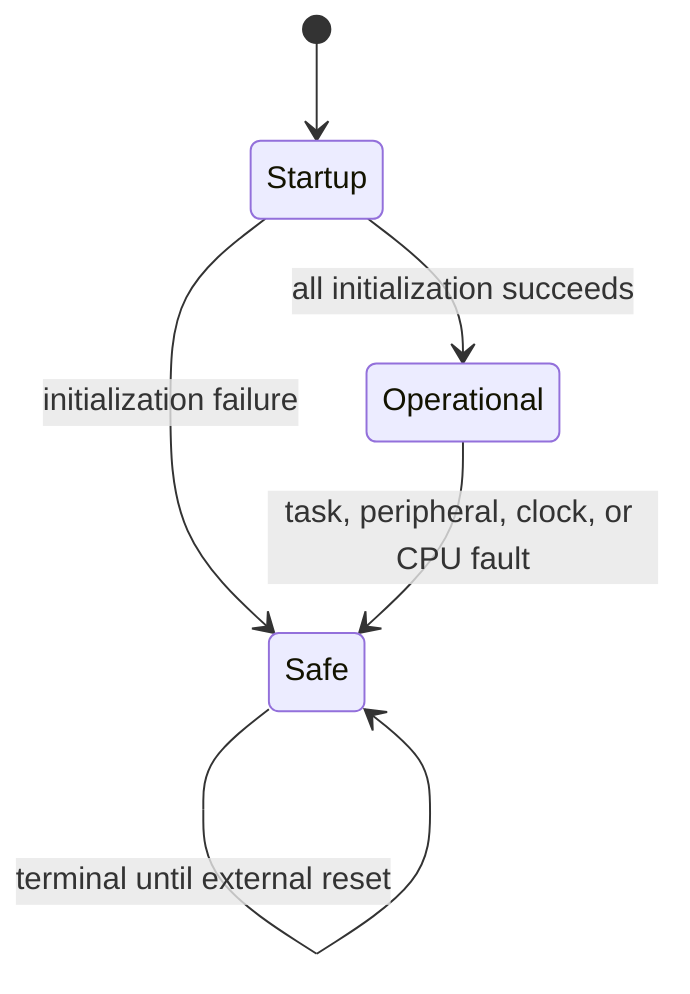

# STM32G431RB peripheral safety demonstrator

This is an educational, bare-metal C++17 project for an STM32G431RB. It shows
how to structure GPIO, timers, UART, interrupts, a cooperative scheduler, and a
terminal safe state using automotive-style defensive practices. It is **not an
ISO 26262 safety element, production ECU, or ASIL-qualified implementation**.

## Defined item and boundary

The software configures a 24 MHz HSE/PLL clock to 100 MHz, displays a four-digit
seconds counter, records two debounced button inputs, configures USART1, emits a
divided system clock on MCO, and runs two TIM8 output-compare channels. The item
boundary is the MCU pin interface. External drivers, display transistor
polarity, button wiring, power supply, debug configuration, startup assembly,
linker script, and board option bytes are outside this source archive and must
be verified before target use.

The expected board configuration is:

| Function | Pins / setting | Contract |
|---|---|---|
| HSE | PF0/PF1, 24 MHz crystal | Crystal mode; HSE bypass disabled |
| Segments A–G | PA4, PA5, PA6, PA7, PA11, PA9, PA10 | Common-anode: low is on |
| Digit selects 1–4 | PC2, PC3, PC10, PC12 | High is enabled; low is safe/off |
| Buttons 0–1 | PA0, PA1 | Internal pull-up; falling-edge event |
| USART1 TX/RX | PC4/PC5, AF7 | 9,600 baud, 8N1, SYSCLK source |
| TIM8 CH1/CH2 | PC6/PC7, AF4 | Toggle output compare, 20 kHz timer period |
| MCO | PA8, AF0 | SYSCLK / 16 = 6.25 MHz |

PA5 is also connected to the Nucleo status LED. This project assigns PA5 to
display segment B, so the status LED is deliberately not configured or owned by
another module.

## Project layout

```text
Core/Inc/             C++ public interfaces, types, constants, inline helpers
Core/Src/             C++ register access and application behavior
Core/Drivers/CMSIS/   Unmodified ST/Arm CMSIS headers
Core/Drivers/Src/     C++17 CMSIS system/ABI implementation
Core/Startup/         Vendor startup assembly and interrupt vector table
tests/                 Hardware-independent host unit tests
cmake/                 Arm GNU toolchain configuration
*.md                   Requirements, traceability, coding policy, and evidence
```

Source files still use includes such as `#include "board.hpp"`. CMake adds
`Core/Inc/` to the compiler's include search path, so hard-coding
`Core/Inc/board.hpp` in every source file is unnecessary and would make reuse
less flexible.

The CMSIS headers originated in the C project, but they are intentionally not
translated or patched: the vendor headers already support C++ and provide
`extern "C"` guards. `Core/Drivers/CMakeLists.txt` exposes them through the
`STM32::CMSIS` target. `Core/Drivers/Src/cmsis_device.cpp` implements the CMSIS
system symbols as C++17 while retaining C linkage for startup assembly and the
interrupt ABI.

If the C++ syntax is unfamiliar, start with `BEGINNER_CPP_GUIDE.md`; it explains
callbacks, `void*`, references, RAII, `constexpr`, `static_assert`, `volatile`,
bit masks, BSRR, and `extern "C"`, then gives a recommended source-reading order.

## System states and fault reaction

The state machine is intentionally small:



`Core/Src/safety_manager.cpp` owns transitions. In Safe state it disables TIM8 MOE and
counter operation, stops TIM6, blanks the display, disconnects MCO, records the
status/source plus SCB fault registers, disables interrupts, and halts. There is
no automatic recovery because this demonstration has no validated recovery
strategy. The sampled record is intended for debugger inspection and is not
retained across power loss.

Clock waits and polling UART operations are bounded. HSI remains enabled after
the PLL switch. The Clock Security System raises NMI on HSE failure, and NMI
uses the same safe-state path.

## Scheduling and concurrency rules

- The cooperative scheduler has a fixed capacity of 25 tasks and no heap use.
- Periods are limited to `0x7FFFFFFF` ms so unsigned wraparound comparisons are
  unambiguous under the documented execution assumption.
- A delayed task runs at most once per scheduler pass. Skipped releases are
  counted instead of generating a catch-up burst.
- Callback failures propagate to the safety manager.
- ISRs acknowledge the hardware request and set bounded event flags only.
- Interrupt priorities are TIM6=2, EXTI0/1=6, SysTick=7 (lower number means
  higher urgency); both EXTI handlers use the same pre-emption priority.
- Main-context read/clear of ISR flags uses a short RAII PRIMASK critical
  section. Equal EXTI pre-emption priority prevents their flag updates from
  interrupting one another.
- Aligned 32-bit ISR/shared counters are atomic on Cortex-M4. `volatile` is used
  for asynchronous visibility, not as a lock.

## Build policy

The source policy is C++17, fixed-width types at hardware boundaries, no
exceptions, no RTTI, no recursion, no dynamic allocation in project code, and
warnings-as-errors. `CMakeLists.txt` contains two deliberately separate build
modes: native unit tests for the PC and a complete STM32 ELF/HEX/BIN build.

List every available preset with:

```sh
cmake --list-presets=all
```

### Host unit tests

```sh
cmake --preset host-debug
cmake --build --preset host-debug
ctest --preset host-debug
```

This preset uses the PC compiler and builds only `Core/Src/scheduler.cpp` plus the
hardware-independent tests. It does not produce firmware for the MCU.

### STM32 debug firmware

The firmware preset uses these platform files:

```text
Core/Startup/startup_stm32g431rbtx.s
Core/Drivers/CMakeLists.txt
Core/Drivers/Src/cmsis_device.cpp
Core/Drivers/CMSIS/Device/ST/STM32G4xx/Include/
Core/Drivers/CMSIS/Include/
linker/STM32G431RBTX_FLASH.ld
```

It also requires `arm-none-eabi-gcc`, `arm-none-eabi-g++`,
`arm-none-eabi-objcopy`, and `arm-none-eabi-size` on `PATH`. Configure and build
with:

```sh
cmake --preset stm32-debug
cmake --build --preset stm32-debug
```

The outputs are written to `build/stm32-debug/`:

```text
stm32g431rb.elf   linked firmware and debug symbols
stm32g431rb.hex   Intel HEX flashing image
stm32g431rb.bin   raw binary flashing image
stm32g431rb.map   link map for memory and symbol review
```

### STM32 release firmware

```sh
cmake --preset stm32-release
cmake --build --preset stm32-release
```

Release outputs use `build/stm32-release/`. Delete that build directory before
switching compiler installations or making major toolchain changes; a CMake
cache remembers absolute compiler paths.

The original C application's `main.c`, `stm32g4xx_it.c`, `scheduler.c`, timer,
UART, interrupt, display, and peripheral-configuration `.c` modules are **not**
part of the C++ target. Their responsibilities now live in `Core/Src/*.cpp`;
adding both implementations would cause duplicate definitions and conflicting
initialization. Only the startup/vector-table file remains assembly; all
compiled driver and application sources are C++17.

If the platform tree uses different locations, override an individual cached
path while configuring, for example:

```sh
cmake --preset stm32-debug \
  -DSTM32_LINKER_SCRIPT=/absolute/path/STM32G431RBTX_FLASH.ld \
  -DSTM32_DRIVERS_DIR=/absolute/path/to/Drivers
```

CMake stops at configuration with the exact missing path if one of these
required platform inputs is absent.

## Verification status and limitations

The hardware-independent display encoder and scheduler are covered by
warning-clean host tests, including boundaries, invalid registration, capacity,
callback failure, time wraparound, and missed releases. See
`CHECKLIST_APPLICATION.md` and `TRACEABILITY.md` for evidence and remaining
actions.

Before using this on a vehicle or safety-related bench, at minimum verify the
pin map and electrical safe levels, run a clean Arm target build, measure MCO
and timer outputs, test every safe-state transition, define and validate the
watchdog strategy, configure brownout/voltage supervision, add Flash/RAM
integrity mechanisms, measure stack/WCET/jitter, run static analysis with the
contractually chosen MISRA rules, and perform the required system HARA/TARA and
independent reviews.

## Device references

- [STM32G4 reference manual RM0440](https://www.st.com/resource/en/reference_manual/rm0440-stm32g4-series-advanced-armbased-32bit-mcus-stmicroelectronics.pdf)
- [STM32G4 safety manual UM2454](https://www.st.com/resource/en/user_manual/um2454-stm32g4-series-safety-manual-stmicroelectronics.pdf)
- [STM32G431 datasheet](https://www.st.com/resource/en/datasheet/stm32g431c6.pdf)
- [Official STM32G4 CMSIS device headers](https://github.com/STMicroelectronics/cmsis-device-g4)
